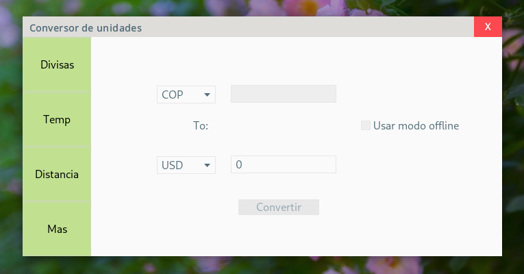
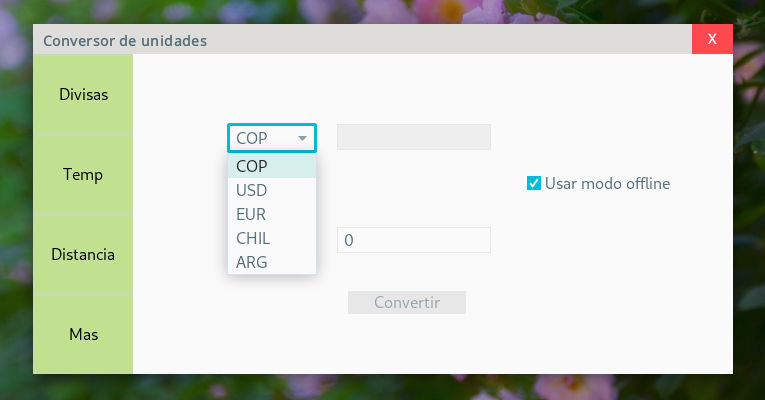
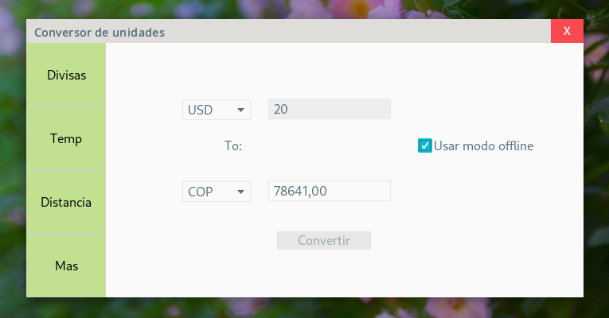
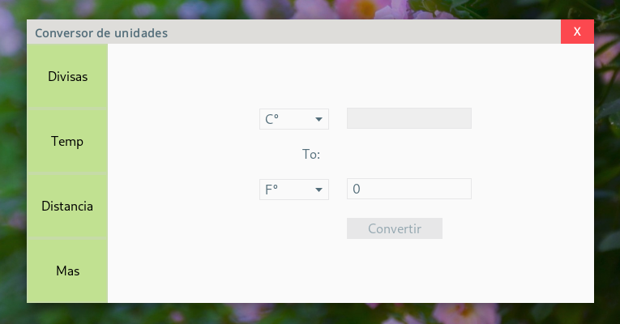
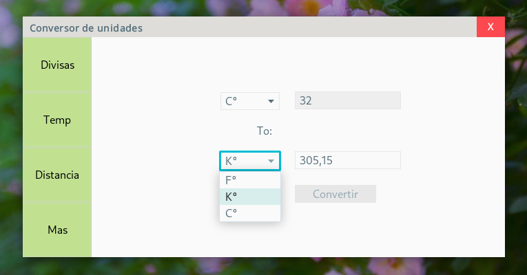
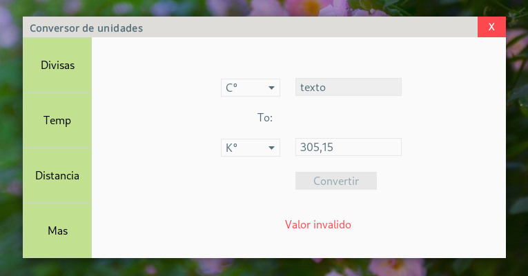

# Conversor ONE
Conversor de divisas y temperatura, otros tipos de unidades de medida seran añadidos en versiones futuras.

## Screenshots
### Ventana principal:
 
---
### Monedas Disponibles:

---
### Conversion Offline:

---
### Conversion de temperatura:

---
### Unidades de temperatura disponibles:

---
### Validacion de Input:

---

## Intrucciones de Uso:
Descarga la ultima version del archivo .jar en Releases.
El conversor consta de unos botones al lado izquierdo de la ventana, los cuales cambian el tipo de conversion que queremos usar (Divisas, temperatura, ...).

El conversor de divisas cuanta con un checkbox que activa el modo offline, este modo carga los rates de las monedas almacenados en cache, perteneciendo a la ultima consulta en online.

El conversor de temperaturas no necesita una conexión a internet.

# TO-DO
- [ ] Terminar este README.
- [x] Agregar instrucciones de uso.
- [x] Screnshots del programa.
- [x] Logica de conversion de divisas offline
- [x] Logica de conversion de divisas online con api de ~~yahoo~~ fixer.io.
- [x] Logica de conversion de temperaturas
- [x] Funcionalidad de conversor de temperaturas
